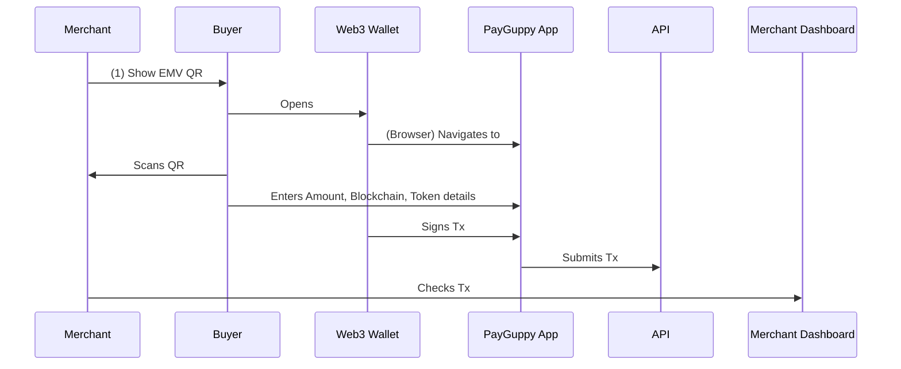
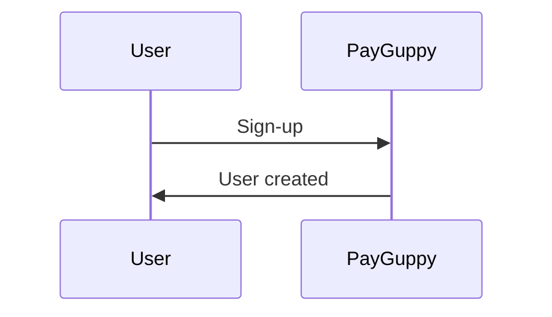
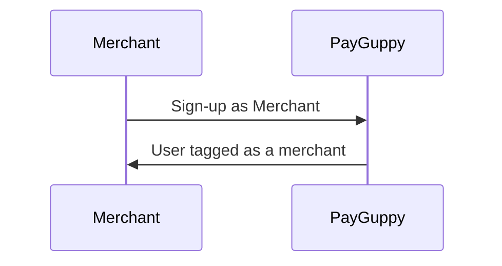
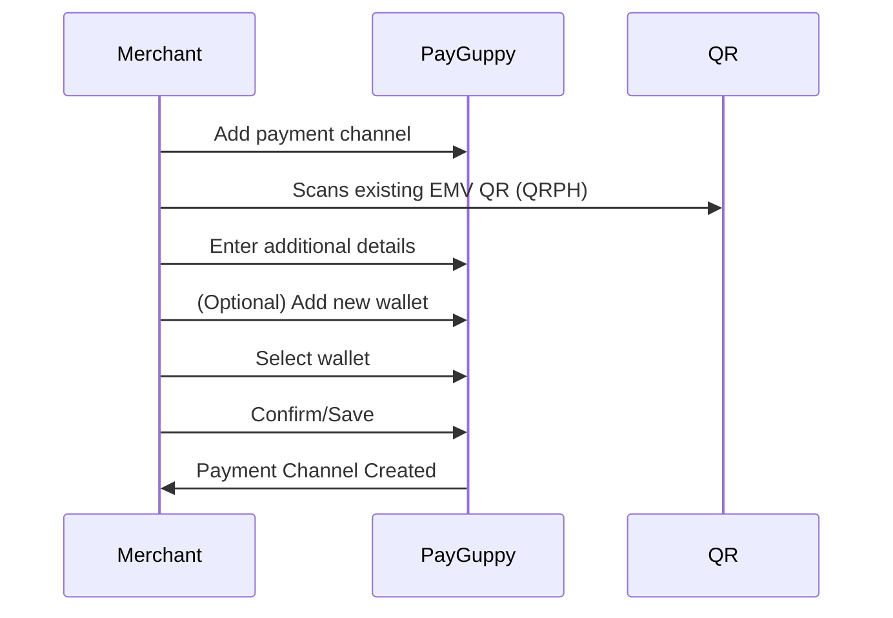
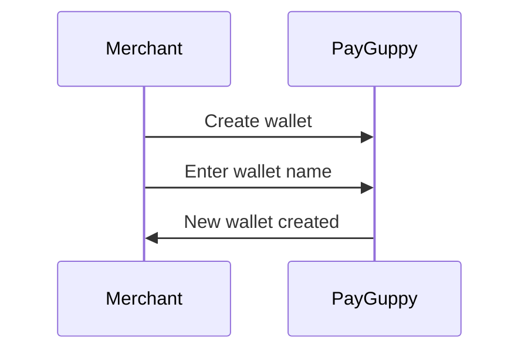

# PayGuppy

PayGuppy is a web3 application designed to help traditional businesses accept cryptocurrency payments. It simplifies the process by allowing merchants to use their existing payment infrastructure, such as standard EMV QR codes like QRPH in the Philippines. This means businesses can start receiving various cryptocurrencies and tokens immediately without needing new hardware or complicated setups.

A key feature of PayGuppy is that it does not automatically convert these crypto payments into fiat currency (e.g., US Dollars or Philippine Pesos). This unique approach empowers merchants by allowing them to hold the digital assets they receive, opening up opportunities to participate directly in Decentralized Finance (DeFi) protocols.

Looking ahead, PayGuppy plans to introduce a token-based rewards system, enabling merchants to issue digital tokens to build customer loyalty. Additionally, a "Social-Fi" (Social Finance) feature is in development, which will allow businesses to post discounts and promotions directly on the app for users to discover and avail, creating a dynamic and interactive marketplace.

# Overview

## Payments

#### Payment flow
1. Merchant shows the EMV QR (QRPH) code to the buyer
2. Buyer opens Web3 wallet (Metamask, Phantom, Petra)
3. Navigate to payguppy.xyz and connect wallet
4. Buyer scans the QR code
5. Buyer enters the amount, selects blockchain and token details and optional memo string
6. Pay button prompts for Wallet signing
7. The app will submit the tx details to the API for monitoring
8. Merchant checks on the Merchant Dashboard to confirm

## User-specific features

### Onboarding - Buyer
By default a user could perform buying. Signing-up can be done using wallet connect, google auth (or other socmed).
We will also require the user to enter a name/handle

Details needed:
* name
* handle

### User Profile
Details shown in user profile:
* Name, handle, external wallet address
* $GUP balance
* Latest transctions

### User > All transaction
User should be able to see all their transactions

## Merchant-specific features

### Onboarding - Merchant
A user could be a merchant.

> MH: Do we open that option to everyone or should this be a paid/whitelisted feature?

### Creating Payment Channel
Payment channels refers to the way people could purchase.
Right now we have EMVQR and a future online QR that can be shown to merchant's checkout page

### Creating Wallets
Wallets are where your funds will be transferred to upon buyer payment.
This can either be access on a separate nav button or during the payment channel creation.

## Dashboard: Transactions
Merchant should be able to view the transactions

As usual, sorting and pagination should be enabled

Filters:
* by buyer
* by date
* by payment channel
* by wallet
* by blockchain
* by token

## Dashboard: Visualiations
1. Line chart showing daily amount in stables (USD) of sales
